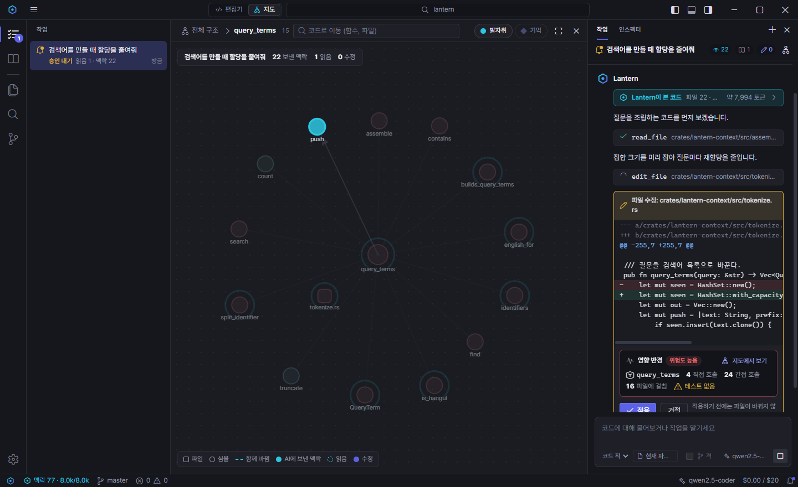

# Lantern IDE

**에이전트가 무엇을 보고, 무엇을 바꾸고, 그 수정이 어디까지 닿는지 보여주는 AI 코드 편집기.**

[English](README.md) · Windows 베타 · Apache-2.0 · 모델은 직접 고름 (Claude, OpenAI 호환, Ollama, LM Studio)



> **베타입니다.** 개발자 한 명이 만드는 초기 소프트웨어입니다. 확인된 환경은 Windows이고, macOS·Linux는 CI에서 빌드만 됩니다. 불편한 점은 [이슈로 알려 주세요](https://github.com/Lantern-IDE/lantern/issues/new/choose).

## 왜 또 AI 편집기인가

대부분의 AI 편집기는 "파일과 채팅"이 중심입니다. 그런데 에이전트에게 코드를 맡기기 시작하면 궁금한 것이 바뀝니다. *무엇을 보고, 무엇을 건드렸고, 또 어디가 깨질까?* Lantern은 이 질문을 중심으로 만들었습니다.

- **코드 지도.** 가운데 화면이 편집기와 코드 지도를 오갑니다. 폴더 → 파일 → 함수, 호출 관계, 자주 함께 바뀌던 파일이 보입니다.
- **수정마다 영향 반경.** 에이전트의 수정을 승인하기 전에, 바뀌는 함수, 직접·간접 호출자, 관련 테스트(없으면 없다고), 위험도를 카드에 보여줍니다. 누르면 지도에서 볼 수 있습니다.
- **에이전트 발자취.** 작업마다 AI에 보낸 맥락, 읽은 파일, 고친 파일을 기록하고 지도 위에 칠합니다.
- **프로젝트 기억 지도.** 팀 규칙은 `.lantern/memory/*.md`에 적고, Lantern이 규칙마다 관련 코드와 이어 줍니다.
- **탭이 아니라 작업.** 작업마다 대화, 맥락, 바뀐 파일, 되돌리기가 묶입니다. 다시 켜도 남아 있고, git worktree에 격리해서 돌리면 적용하기 전까지 작업 폴더가 바뀌지 않습니다.
- **숨기지 않음.** 숨은 시스템 프롬프트가 없고, 인스펙터에서 모델에 보낸 파일·토큰·비용을 전부 볼 수 있습니다. 사용 통계를 수집하지 않습니다.

## 맥락 엔진

핵심은 로컬 맥락 엔진(`crates/lantern-context`, Rust + tree-sitter + SQLite FTS5)입니다. 질문마다 심볼 그래프, 전문 검색, git 동시 변경 이력, 프로젝트 기억에서 관련 코드를 골라 토큰 예산 안에 조립합니다.

비공개 프로젝트(코드 파일 1,772개, TypeScript/JavaScript)에서 정답 파일을 직접 정한 질문 20개로, 같은 8,000 토큰 예산에서 비교했습니다:

| | 키워드 검색 (grep 후 파일 통째로 읽기) | Lantern |
|---|---|---|
| 정답 파일 적중률 (평균) | 24% | **67%** |
| 정답 파일을 하나라도 가져온 질문 | 35% | **90%** |

방법과 한계: [eval/결과.md](eval/결과.md). 평가 스크립트는 `eval/`에 있으니 자기 프로젝트와 질문으로 돌려 볼 수 있습니다 ([형식](eval/README.md)). 오픈소스 코드베이스로 만든 공개 벤치마크를 준비하고 있습니다.

맥락 엔진은 CLI와 MCP 서버로 따로 쓸 수도 있습니다:

```bash
cargo build --release -p lantern-context
./target/release/lantern -C <프로젝트> context "세션 쿠키는 어디서 발급해?"
./target/release/lantern -C <프로젝트> graph impact src/auth/session.ts --lines 40-60   # 영향 반경 (JSON)
claude mcp add lantern -- <lantern 경로> mcp <프로젝트>
```

## 설치

[Releases](https://github.com/Lantern-IDE/lantern/releases)에서 받으세요. 아직 코드 서명이 없습니다.

- **Windows** (`*-setup.exe`): SmartScreen 경고가 뜨면 **추가 정보 → 실행**.
- **macOS** (`*.dmg`, Apple Silicon·Intel, 아직 실사용 확인 전): 응용 프로그램 폴더로 옮긴 뒤 터미널에서 `xattr -cr /Applications/Lantern.app`, 또는 **시스템 설정 → 개인정보 보호 및 보안 → 그래도 열기**.
- **Linux** (`*.AppImage`, `*.deb`, 아직 실사용 확인 전).

처음 켜면 **AI 모델 연결하기** 화면이 안내합니다 (나중에는 **설정 → 모델**). Anthropic·OpenAI 호환 API 키, 또는 Ollama·LM Studio 로컬 모델(무료, 코드가 컴퓨터 밖으로 나가지 않음)을 연결합니다. 키는 OS 자격 증명 저장소나 환경변수에 두고, 설정 파일에는 적지 않습니다.

## 소스로 빌드

필요한 것: Rust(stable), Node.js 22, Windows는 WebView2(Windows 11에는 기본 설치). Linux 패키지는 [CI 설정](.github/workflows/ci.yml)을 참고하세요.

```bash
cd app
npm install
npx tauri dev            # 개발
npx tauri build          # 설치 파일: target/release/bundle
```

## 테스트

```bash
cargo test --workspace                     # 맥락 엔진 + IDE 백엔드
cargo clippy --workspace --all-targets -- -D warnings
cd app && npm run typecheck && npm test    # 프론트엔드
cd app && npx tauri build --no-bundle && npm run e2e   # 실제 앱 E2E (Windows)
python scripts/i18n_check.py               # 영어 번역 누락
```

## 문서

- 맥락 엔진 설계와 검증: [docs/Phase0_맥락엔진_설계.md](docs/Phase0_맥락엔진_설계.md), [eval/결과.md](eval/결과.md)
- IDE 구조와 검증: [docs/Phase1-2_IDE.md](docs/Phase1-2_IDE.md)
- 작업과 지도 설계: [docs/차별화_작업과_지도.md](docs/차별화_작업과_지도.md)
- 배포(설치 파일, 자동 업데이트, 서명): [docs/배포_가이드.md](docs/배포_가이드.md)

## 기여

[CONTRIBUTING.md](CONTRIBUTING.md)를 봐 주세요. 보안 문제는 [SECURITY.md](SECURITY.md)로 알려 주세요.

## 라이선스

[Apache-2.0](LICENSE). 제3자 고지: [THIRD_PARTY_NOTICES.md](THIRD_PARTY_NOTICES.md).
