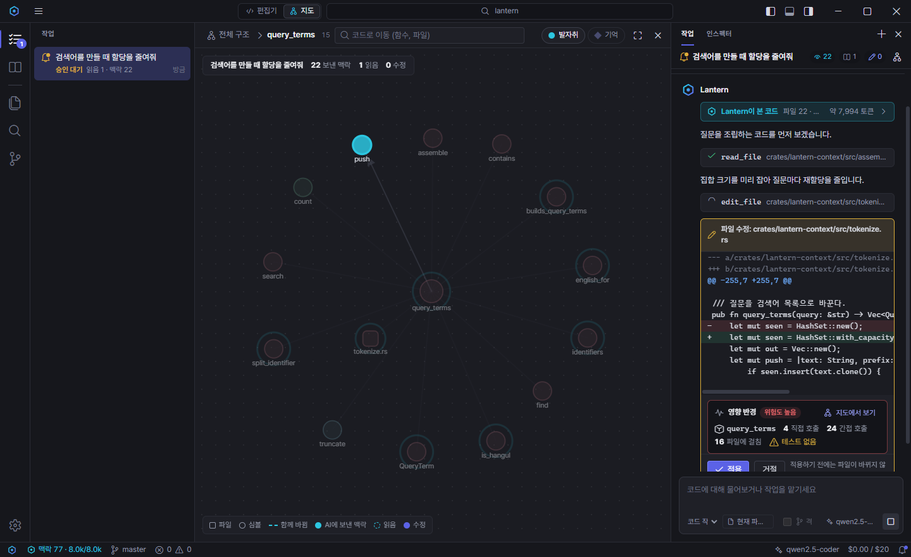

# Lantern IDE

**에이전트가 무엇을 보고, 무엇을 바꾸고, 그 수정이 어디까지 닿는지 보여주는 AI 코드 편집기.**

[English](README.md) · Windows 베타 · Apache-2.0 · 모델은 직접 고름 (Claude, GPT, Gemini, DeepSeek, Grok, Mistral, Groq, OpenRouter, Ollama, LM Studio, 그 밖의 OpenAI 호환 API)



> **베타입니다.** 개발자 한 명이 만드는 초기 소프트웨어입니다. 확인된 환경은 Windows이고, macOS·Linux는 CI에서 빌드만 됩니다. 불편한 점은 [이슈로 알려 주세요](https://github.com/Lantern-IDE/lantern/issues/new/choose).

## 왜 또 AI 편집기인가

대부분의 AI 편집기는 "파일과 채팅"이 중심입니다. 그런데 에이전트에게 코드를 맡기기 시작하면 궁금한 것이 바뀝니다. *무엇을 보고, 무엇을 건드렸고, 또 어디가 깨질까?* Lantern은 이 질문을 중심으로 만들었습니다.

- **코드 지도.** 가운데 화면이 편집기와 코드 지도를 오갑니다. 폴더 → 파일 → 함수, 호출 관계, 자주 함께 바뀌던 파일이 보입니다.
- **수정마다 영향 반경.** 에이전트의 수정을 승인하기 전에, 바뀌는 함수, 직접·간접 호출자, 관련 테스트(없으면 없다고), 위험도를 카드에 보여줍니다. 누르면 지도에서 볼 수 있습니다.
- **에이전트 발자취.** 작업마다 AI에 보낸 맥락, 읽은 파일, 고친 파일을 기록하고 지도 위에 칠합니다.
- **프로젝트 기억 지도.** 팀 규칙은 `.lantern/memory/*.md`에 적고, Lantern이 규칙마다 관련 코드와 이어 줍니다. 다른 도구의 규칙 파일(`AGENTS.md`, `CLAUDE.md`, `.cursorrules`, `.github/copilot-instructions.md`, `.windsurfrules`, `GEMINI.md`)도 신뢰한 폴더에서 읽습니다.
- **커밋 전 영향 검토.** 소스 제어에서 에이전트 수정뿐 아니라 아직 커밋하지 않은 변경 전체의 영향 반경을 보고, AI에게 리뷰를 맡길 수 있습니다. 커밋 메시지도 저장소의 기존 형식대로 써 줍니다.
- **탭이 아니라 작업.** 작업마다 대화, 맥락, 바뀐 파일, 되돌리기가 묶입니다. 다시 켜도 남아 있고, git worktree에 격리해서 돌리면 적용하기 전까지 작업 폴더가 바뀌지 않습니다.
- **숨기지 않음.** 숨은 시스템 프롬프트가 없고, 인스펙터에서 모델에 보낸 파일·토큰·비용을 전부 볼 수 있습니다. 사용 통계를 수집하지 않습니다.

## 맥락 엔진

핵심은 로컬 맥락 엔진(`crates/lantern-context`, Rust + tree-sitter + SQLite FTS5)입니다. 질문마다 심볼 그래프, 전문 검색, git 동시 변경 이력, 프로젝트 기억에서 관련 코드를 골라 토큰 예산 안에 조립합니다.

엔진이 이해하는 언어(심볼, 호출 관계, 지도, 영향 반경): Rust, Python, TypeScript/JavaScript, Java, Go, C#. 그 밖의 파일도 코드 색은 나오지만 심볼은 없습니다.

**공개 벤치마크.** [Flask](https://github.com/pallets/flask)(Python), [Hono](https://github.com/honojs/hono)(TypeScript), [Apache Commons Lang](https://github.com/apache/commons-lang)(Java)의 실제 커밋 60개로 쟀습니다. 질문은 커밋 메시지, 정답 파일은 그 커밋이 고친 코드 파일이고, 각 질문은 그 커밋의 부모 시점에서 잽니다. 정답을 사람이 고르지 않습니다. 같은 8,000 토큰 예산, 모델 호출 없음:

| | 키워드 검색 (grep 후 파일 통째로) | 키워드 검색 (grep, 맞은 곳 앞뒤만) | Lantern |
|---|---|---|---|
| 정답 파일 적중률 (평균) | 13% | 41% | **88%** |
| 처음 3개 파일 안에 정답 | 15% | 30% | **65%** |
| 같은 질문을 한국어로: 적중률 / 처음 3개 | 13% / 13% | 38% / 27% | **76% / 43%** |

Lantern이 가져온 것과 같은 수의 파일을 무작위로 고르면 정답을 가져올 확률은 10%입니다. 한국어 질문은 같은 커밋 메시지를 사람이 옮긴 것입니다. `node eval/bench/run.mjs`로 재현할 수 있습니다 ([결과](eval/bench/결과.md), [방법](eval/README.md)). 자기 프로젝트와 질문으로는 `eval/retrieval.mjs`를 쓰면 됩니다.

**의미 검색 (선택).** 임베딩 서버를 설정하면 키워드가 겹치지 않아도 질문과 뜻이 가까운 코드를 찾아 엔진의 순위와 합칩니다. 같은 벤치마크에서 작은 로컬 모델(`embeddinggemma-300m`)로 재면 적중률 88% → **93%**, 앞 3개 65% → **73%**, 한국어는 76% → **86%**, 43% → **52%**이고, 질문당 가져오는 파일은 5개쯤 늘어납니다 ([결과](eval/bench/결과-의미검색.md)). 기본은 꺼져 있습니다. `config.toml`에 OpenAI 호환 `/embeddings` 서버(OpenAI, Ollama, LM Studio 등)를 적으면 켜지고, 코드 조각(비밀 값은 가림)이 그 서버로 갑니다. 처음 켜면 프로젝트 전체를 뒤에서 임베딩하는데, CPU로 돌리는 로컬 모델은 큰 프로젝트에서 몇 시간 걸릴 수 있습니다.

```toml
[embeddings]
base_url = "https://api.openai.com/v1"
model = "text-embedding-3-small"
api_key_env = "OPENAI_API_KEY"
```

맥락 엔진은 CLI와 MCP 서버로 따로 쓸 수도 있습니다:

```bash
cargo build --release -p lantern-context
./target/release/lantern -C <프로젝트> context "세션 쿠키는 어디서 발급해?"
./target/release/lantern -C <프로젝트> graph impact src/auth/session.ts --lines 40-60   # 영향 반경 (JSON)
claude mcp add lantern -- <lantern 경로> mcp <프로젝트>
```

## 설치

[Releases](https://github.com/Lantern-IDE/lantern/releases)에서 받으세요. 아직 코드 서명이 없습니다.

- **Windows** (`*-setup.exe`): SmartScreen 경고가 뜨면 **추가 정보 → 실행**.
- **macOS** (`*.dmg`, Apple Silicon·Intel, 아직 실사용 확인 전): 응용 프로그램 폴더로 옮긴 뒤 터미널에서 `xattr -cr /Applications/Lantern.app`, 또는 **시스템 설정 → 개인정보 보호 및 보안 → 그래도 열기**.
- **Linux** (`*.AppImage`, `*.deb`, 아직 실사용 확인 전).

처음 켜면 **AI 모델 연결하기** 화면이 안내합니다 (나중에는 **설정 → 모델**). 클라우드 제공자(Anthropic, OpenAI, Google Gemini, DeepSeek, xAI, Mistral, Groq, OpenRouter)를 고르고 키를 넣은 뒤 그 회사의 모델 목록에서 모델을 고르거나, Ollama·LM Studio 로컬 모델(무료, 코드가 컴퓨터 밖으로 나가지 않음)을 연결합니다. 그 밖의 OpenAI 호환 API는 **설정 → 모델**에서 추가합니다. 채팅 입력창의 모델 버튼으로 연결해 둔 모델끼리 바로 바꿀 수 있습니다. 키는 OS 자격 증명 저장소나 환경변수에 두고, 설정 파일에는 적지 않습니다.

### ChatGPT 구독이나 Google 계정으로 쓰기 (외부 에이전트)

Lantern은 각 회사의 공식 에이전트 CLI를 [Agent Client Protocol](https://agentclientprotocol.com)로 부릴 수 있습니다. 로그인은 그 CLI가 직접 하므로 API 키 없이 ChatGPT 구독이나 Google 계정으로 쓸 수 있고, Lantern은 로그인 정보를 보지 않습니다.

| 에이전트 | 설치 | 로그인 |
|---|---|---|
| Codex | `npm install -g @zed-industries/codex-acp` | ChatGPT(유료 요금제) 또는 OpenAI API 키 |
| Gemini CLI | `npm install -g @google/gemini-cli` | Google 계정 또는 Gemini API 키 |

채팅의 에이전트 선택에서 **Codex (외부)**나 **Gemini CLI (외부)**를 고릅니다. 처음에는 그 에이전트의 로그인 방법(대개 브라우저)이 카드로 나옵니다. 나머지는 Lantern 그대로입니다: 질문마다 Lantern 맥락을 붙이고(에이전트에게 Lantern을 MCP 서버로도 넘김), 수정은 영향 반경이 붙은 승인 카드로 오며, 바뀐 것은 되돌릴 수 있습니다. 외부 에이전트는 신뢰한 폴더에서만 켜집니다. 다른 ACP 에이전트는 `config.toml`의 `[acp.<이름>] command = "…"`로 더할 수 있습니다.

Claude 구독(Pro/Max)은 이렇게 쓸 수 없습니다. Anthropic 약관이 구독 로그인을 자사 앱에만 허용합니다. Anthropic API 키를 쓰세요.

### MCP 서버 쓰기

stdio로 도는 MCP 서버(이슈 트래커, DB, 브라우저 등)를 **설정 → MCP 서버**나 `config.toml`에 넣으면 **코드 작성** 에이전트가 그 도구를 씁니다. 부를 때마다 승인 카드를 거치고, 승인 없이 실행할 도구는 설정에서 고를 수 있습니다. 외부 에이전트에도 같은 서버를 넘기며, 신뢰한 폴더에서만 씁니다.

```toml
[mcp.github]
command = "npx"
args = ["-y", "@modelcontextprotocol/server-github"]
env = { GITHUB_PERSONAL_ACCESS_TOKEN = "…" }
```

## 소스로 빌드

필요한 것: Rust(stable), Node.js 22, Windows는 WebView2(Windows 11에는 기본 설치). Linux 패키지는 [CI 설정](.github/workflows/ci.yml)을 참고하세요.

```bash
cd app
npm install
npx tauri dev            # 개발
npx tauri build          # 설치 파일: target/release/bundle
```

## 테스트

```bash
cargo test --workspace                     # 맥락 엔진 + IDE 백엔드
cargo clippy --workspace --all-targets -- -D warnings
cd app && npm run typecheck && npm test    # 프론트엔드
cd app && npx tauri build --no-bundle && npm run e2e   # 실제 앱 E2E (Windows)
python scripts/i18n_check.py               # 영어 번역 누락
```

## 문서

- 맥락 엔진 설계와 검증: [docs/Phase0_맥락엔진_설계.md](docs/Phase0_맥락엔진_설계.md), [eval/결과.md](eval/결과.md)
- IDE 구조와 검증: [docs/Phase1-2_IDE.md](docs/Phase1-2_IDE.md)
- 작업과 지도 설계: [docs/차별화_작업과_지도.md](docs/차별화_작업과_지도.md)
- 배포(설치 파일, 자동 업데이트, 서명): [docs/배포_가이드.md](docs/배포_가이드.md)

## 기여

[CONTRIBUTING.md](CONTRIBUTING.md)를 봐 주세요. 보안 문제는 [SECURITY.md](SECURITY.md)로 알려 주세요.

## 라이선스

[Apache-2.0](LICENSE). 제3자 고지: [THIRD_PARTY_NOTICES.md](THIRD_PARTY_NOTICES.md).
