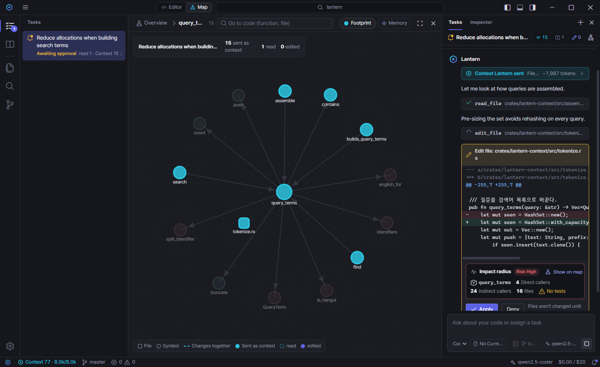

# Lantern IDE

**An AI code editor that shows you what the agent sees, what it changes, and how far the change reaches.**

[한국어](README.ko.md) · Windows beta · Apache-2.0 · Bring your own model (Claude, OpenAI-compatible, Ollama, LM Studio)



> **Beta.** Lantern is young software built by one developer. Windows is the tested platform; macOS and Linux build in CI but have not been used day to day. Expect rough edges and please [report them](https://github.com/Lantern-IDE/lantern/issues/new/choose).

## Why another AI editor?

Most AI editors are organised around files and a chat box. Once you let an agent edit code, the questions change: *what did it look at, what did it touch, and what else will break?* Lantern is organised around those questions.

- **Code map.** The centre of the window switches between the editor and a live map of your code (folders → files → symbols, calls, and files that usually change together).
- **Impact radius on every edit.** Before you approve an agent's edit, the card shows the symbols it touches, direct and indirect callers, the tests that cover them (or that there are none), and a risk level. One click shows it on the map.
- **Agent footprint.** Each task records what was sent as context, what the agent read, and what it edited, and paints it on the map.
- **Project memory map.** Team conventions live in `.lantern/memory/*.md`; Lantern links each rule to the code it talks about.
- **Tasks, not tabs.** A task keeps its conversation, context, changed files, and undo together. Tasks survive restarts, and can run in an isolated git worktree so nothing touches your working tree until you apply it.
- **Nothing hidden.** No hidden system prompt; the inspector shows every file, token, and cent sent to the model. No telemetry.

## Context engine

The core is a local context engine (`crates/lantern-context`, Rust + tree-sitter + SQLite FTS5). For every question it assembles relevant code from the symbol graph, full-text search, git co-change history, and project memory within a token budget.

On a private 1,772-file TypeScript/JavaScript project with 20 hand-labelled questions, at the same 8,000-token budget:

| | Keyword search (grep, then read whole files) | Lantern |
|---|---|---|
| Answer files retrieved (mean recall) | 24% | **67%** |
| Questions with at least one answer file | 35% | **90%** |

Method and caveats: [eval/결과.md](eval/결과.md) (Korean). The evaluation script is in `eval/`; bring your own project and question set ([format](eval/README.md)). A public benchmark on an open-source codebase is planned.

The engine also runs on its own as a CLI and an MCP server, so you can use it from other agents:

```bash
cargo build --release -p lantern-context
./target/release/lantern -C <project> context "where is the session cookie issued?"
claude mcp add lantern -- <path-to-lantern> mcp <project>
```

## Install

Download from [Releases](https://github.com/Lantern-IDE/lantern/releases). Builds are not code-signed yet:

- **Windows** (`*-setup.exe`): when SmartScreen warns you, choose **More info → Run anyway**.
- **macOS** (`*.dmg`, Apple Silicon and Intel, untested): drag Lantern to Applications, then run `xattr -cr /Applications/Lantern.app` or allow it in **System Settings → Privacy & Security → Open Anyway**.
- **Linux** (`*.AppImage`, `*.deb`, untested).

On first run, **Connect an AI Model** walks you through it (later: **Settings → Models**): an Anthropic or OpenAI-compatible key, or a local model through Ollama / LM Studio (free, and your code never leaves the machine). Keys go to the OS credential store or environment variables, never to the config file.

## Build from source

Requirements: Rust (stable), Node.js 22, and on Windows WebView2 (preinstalled on Windows 11). Linux needs `libwebkit2gtk-4.1-dev` and friends (see [CI](.github/workflows/ci.yml)).

```bash
cd app
npm install
npx tauri dev            # development
npx tauri build          # installer in target/release/bundle
```

## Tests

```bash
cargo test --workspace                     # context engine + app backend
cargo clippy --workspace --all-targets -- -D warnings
cd app && npm run typecheck && npm test    # frontend
cd app && npx tauri build --no-bundle && npm run e2e   # drives the real app (Windows)
python scripts/i18n_check.py               # missing English strings
```

## Project layout

| Path | What |
|---|---|
| `crates/lantern-context` | Context engine library, `lantern` CLI, MCP server |
| `app/` | The IDE: Tauri v2 + CodeMirror 6 frontend, Rust backend in `app/src-tauri` |
| `eval/` | Retrieval evaluation and model A/B harness |
| `docs/` | Design notes (Korean): context engine, IDE, the task-and-map design, release guide |

## Language

The UI ships in Korean and English. Source comments and design docs are mostly Korean; issues and pull requests in English or Korean are both welcome.

## Contributing

See [CONTRIBUTING.md](CONTRIBUTING.md). Security issues: [SECURITY.md](SECURITY.md).

## License

[Apache-2.0](LICENSE). Third-party notices: [THIRD_PARTY_NOTICES.md](THIRD_PARTY_NOTICES.md).
